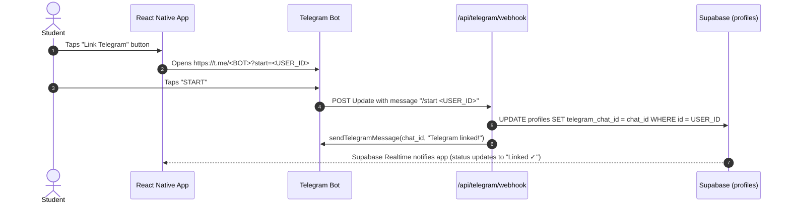

# OneClickHandshake

Browser-automation bot that applies to Handshake jobs on a student's behalf, driven by a one-time onboarding form and orchestrated as durable Vercel Workflow steps.

> **Status:** Phase 1 (Slices A1, A2 & A4 completed) — Supabase schema, RLS policies, serverless API routes (`/api/`), Telegram bot linking with Realtime sync, Google OAuth for Gmail (Phase A4: HMAC-signed state, AES-256-GCM token encryption, `readOtpFromGmail`), and React Native (Expo) onboarding UI implemented and verified.

---

## What it does

1. Student fills a short onboarding form (React Native) → profile + resume stored in Supabase.
2. Student submits a Handshake job link → triggers `handshakeBotWorkflow`.
3. Bot authenticates to Handshake (new-account creation **or** OTP login via Gmail readonly OAuth).
4. Bot completes Quick Apply / Apply, attaches the stored resume via "Upload new," and answers reusable screening questions.
5. Missing documents or novel questions pause the workflow and prompt the student over Telegram; answers are saved for reuse.
6. Unhandled blocking steps surface a live browser view (live handoff) in the app.

---

## Stack

| Layer | Tool |
|---|---|
| Frontend | React Native (Expo) |
| Backend / DB / Auth | Supabase (Postgres, Storage, RLS, Realtime) |
| API + orchestration | Vercel Functions + Vercel Workflows |
| Browser automation | `playwright-core` + `@sparticuz/chromium` |
| OTP read | Gmail API (readonly OAuth scope) |
| Missing doc/answer capture | Telegram Bot API |
| Transactional email | Resend |

---

## Project docs

All six spec files live under [`ProjectDocs/`](./ProjectDocs/):

| File | Purpose |
|---|---|
| [`01-prd.md`](./ProjectDocs/01-prd.md) | Product requirements & success metrics |
| [`02-trd.md`](./ProjectDocs/02-trd.md) | Technical architecture & stack rationale |
| [`03-workflow.md`](./ProjectDocs/03-workflow.md) | Step-by-step bot workflow (Handshake selectors, branching) |
| [`04-ui-ux.md`](./ProjectDocs/04-ui-ux.md) | Onboarding screen field list & UI conventions |
| [`05-backend-schema.md`](./ProjectDocs/05-backend-schema.md) | Supabase table definitions, indexes, RLS rules, API endpoints |
| [`06-implementation.md`](./ProjectDocs/06-implementation.md) | Phase-by-phase build plan & checkpoints |

---

## Phase 1 — What was shipped

### 1. Supabase schema (`supabase/migrations/20260820000000_initial_schema.sql`)

All six tables defined in `05-backend-schema.md`, applied in a single migration:

| Table | Purpose |
|---|---|
| `profiles` | Core onboarding data: identity, school, job preferences, `has_existing_handshake_account`, `telegram_chat_id` |
| `gmail_oauth_tokens` | Encrypted Gmail refresh/access tokens; **zero** client-role read access (service-role only) |
| `resumes` | Supabase Storage path + size for the student's resume PDF |
| `documents` | Non-resume files gathered via Telegram (cover letters, transcripts, etc.) |
| `reusable_answers` | Screening Q&A cache: checked before every Telegram fallback prompt |
| `bot_runs` | One row per workflow run; tracks status, `actions_count` (300/day cap), and `workflow_run_id` |

**RLS:** every table has RLS enabled. Default policy: `profile_id = auth.uid()` (or `id = auth.uid()` for `profiles`).
**Exception — `gmail_oauth_tokens`:** no client-role policies at all; all writes go through the Gmail OAuth callback route using the service role.

**Indexes** (matching `05-backend-schema.md` exactly):
- FK columns on `resumes`, `documents`, `reusable_answers`, `bot_runs`, `gmail_oauth_tokens` — all indexed.
- Composite `(profile_id, question_text)` on `reusable_answers` for the "check before asking again" lookup.

### 2. Backend API routes (`api/`)

Vercel Serverless Functions reading directly from `process.env` (free of Expo or bundler dependencies):

- [`api/onboarding.js`](./api/onboarding.js): Accepts authenticated onboarding form payload, validates `.edu` student emails, enforces `<1MB` PDF resume constraint, uploads to Supabase Storage, upserts to `profiles`, records in `resumes`, and returns `{ profile_id, resume_url }`.
- [`api/telegram/webhook.js`](./api/telegram/webhook.js): Telegram Bot API webhook receiving updates:
  - **Account Linking (`/start <userId>`)**: Receives the deep link startup payload from Telegram, extracts `chat_id`, and updates `profiles.telegram_chat_id` using the service-role client.
  - **Generic Message Sender (`sendTelegramMessage`)**: Exported module-level utility supporting formatted HTML/Markdown messages, reply keyboards, and custom message IDs.
  - **Generic Reply Dispatcher (`onTelegramReply`)**: Exported module-level receiver for user responses, architected for Phase A7 workflow resumption and `reusable_answers` caching.
- [`test-telegram.js`](./test-telegram.js): Standalone verification script for testing bot messaging via CLI arguments or environment variables (`node test-telegram.js <chatId> <botToken>`).
- [`api/oauth/gmail/start.js`](./api/oauth/gmail/start.js): Initiates Google OAuth consent with `gmail.readonly` scope. **Phase A4:** offered unconditionally to all users with a profile (not gated on `has_existing_handshake_account`). State param is HMAC-SHA256 signed (10-min TTL) for CSRF protection.
- [`api/oauth/gmail/callback.js`](./api/oauth/gmail/callback.js): Verifies HMAC state, exchanges Google auth code for tokens via `googleapis` `oauth2Client.getToken()`, encrypts `refresh_token` with AES-256-GCM (`GMAIL_TOKEN_ENC_KEY`), and upserts to `gmail_oauth_tokens` via service role.
- **New lib modules (Phase A4):**
  - [`lib/crypto/tokenCipher.js`](./lib/crypto/tokenCipher.js): `encryptToken()` / `decryptToken()` — AES-256-GCM, wire format `iv(12)‖authTag(16)‖ciphertext`, base64-encoded.
  - [`lib/oauth/state.js`](./lib/oauth/state.js): `createState()` / `verifyState()` — HMAC-SHA256 signed OAuth state tokens with nonce + expiry.
  - [`lib/supabase/admin.js`](./lib/supabase/admin.js): `createSupabaseAdmin()` — service-role Supabase client, used only in server-side routes.
  - [`lib/gmail/readOtpFromGmail.js`](./lib/gmail/readOtpFromGmail.js): `readOtpFromGmail(profileId)` — decrypts stored refresh token, queries Gmail API (`from:portgasdiscordace@gmail.com after:<10min>`), decodes MIME body, extracts 6-digit OTP with regex. Throws on all failures; retry/sleep lives at the workflow step level.

---

### Telegram Webhook Setup & Flow



#### Setting Up the Telegram Webhook
1. Create a bot using [@BotFather](https://t.me/BotFather) and copy the HTTP API token into `TELEGRAM_BOT_TOKEN`.
2. Register the webhook with Telegram by visiting:
   ```bash
   https://api.telegram.org/bot<TELEGRAM_BOT_TOKEN>/setWebhook?url=https://<YOUR_DEPLOYMENT_URL>/api/telegram/webhook
   ```
3. Test bot connectivity using the standalone test script:
   ```bash
   node test-telegram.js <YOUR_TELEGRAM_CHAT_ID> <TELEGRAM_BOT_TOKEN>
   ```

### 3. Frontend React Native app (`src/frontend/`)

- Built as a self-contained sub-project with its own `package.json` and Expo dependencies.
- [`src/frontend/config.js`](./src/frontend/config.js) & [`src/frontend/utils/supabase.js`](./src/frontend/utils/supabase.js): Dynamically resolves API endpoints and Supabase configuration.
- [`src/frontend/screens/AuthScreen.js`](./src/frontend/screens/AuthScreen.js): Email & password authentication view for Supabase session management.
- [`src/frontend/screens/OnboardingScreen.js`](./src/frontend/screens/OnboardingScreen.js):
  - Full 20-field onboarding form with client-side PDF picker and direct upload to Supabase Storage.
  - Isolated submit error handling (`submitError` state) preventing premature error messages on mount.
  - Deep linking to Telegram with current `userId` parameter (`https://t.me/<bot>?start=<userId>`).
  - Supabase Realtime subscription on `public:profiles` (`id=eq.${userId}`) + interval polling to instantly reflect "Telegram linked ✓" status when `/start` is received.
  - Unconditional Gmail OAuth trigger, read-only recap state with "Edit Profile" and "Create New Profile" buttons (supporting session sign-out and form reset without page reload).

### 4. Agent rules (`.agents/rules/`)

Four scoped rule files govern each area of the codebase:

| File | Scope | Key constraints |
|---|---|---|
| [`supabase.md`](./.agents/rules/supabase.md) | `supabase/**, api/**` | Schema fidelity to `05-backend-schema.md`; RLS mandatory; `refresh_token` never client-readable |
| [`app.md`](./.agents/rules/app.md) | `app/**, screens/**, components/**` | Field set from `04-ui-ux.md`; no direct service-role table access from app; resume enforced <1 MB client-side |
| [`bot_playwright.md`](./.agents/rules/bot_playwright.md) | `bot/**, workflows/steps/**` | `playwright-core` + `@sparticuz/chromium` only; Quick Apply preferred; always "Upload new"; 300/day cap checked per action |
| [`workflows.md`](./.agents/rules/workflows.md) | `workflows/**, api/bot/**` | `'use workflow'` / `'use step'` only; no bare polling loops; long waits are workflow-level pauses; every branch ends at `safeExit` |

---

## Environment variables

All environment variables are loaded from `.env.development.local` (or Vercel project settings):

| Variable | Used by | Notes |
|---|---|---|
| `SUPABASE_URL` | All API routes, App, RLS test | Public project URL |
| `SUPABASE_ANON_KEY` | API routes & RLS test | Client role; enforced by RLS |
| `SUPABASE_PUBLISHABLE_KEY` | React Native frontend client | Client publishable key |
| `SUPABASE_SERVICE_ROLE_KEY` | OAuth callback, Telegram webhook | Service role; never exposed to client |
| `TELEGRAM_BOT_TOKEN` | Telegram webhook | App-level bot token |
| `TELEGRAM_BOT_USERNAME` | App deep linking | Bot username (`simpleclickonetimeusetestbot`) |
| `GOOGLE_OAUTH_CLIENT_ID` | Gmail OAuth start/callback | Google Cloud project, Testing status |
| `GOOGLE_OAUTH_CLIENT_SECRET` | Gmail OAuth callback | Never returned to client |
| `ENCRYPTION_KEY` | Gmail OAuth token encryption (legacy name) | 32-byte hex string for AES-256-GCM; superseded by `GMAIL_TOKEN_ENC_KEY` |
| `GMAIL_TOKEN_ENC_KEY` | Gmail OAuth token encryption (Phase A4) | 32-byte hex AES-256-GCM key; `tokenCipher.js` checks this first, falls back to `ENCRYPTION_KEY` |
| `OAUTH_STATE_SECRET` | OAuth CSRF state signing (Phase A4) | 32-byte hex HMAC-SHA256 key; signs/verifies the `state` param in the Gmail OAuth flow |
| `RESEND_API_KEY` | Daily report (Phase 6) | Not yet wired |

---

## Security constraints

- **No plaintext credentials** — Handshake and email passwords are never stored. OTP flow uses Gmail readonly OAuth.
- **`gmail_oauth_tokens.refresh_token`** — encrypted at rest; service-role read only; never in API responses or logs.
- **Telegram bot token** — single app-level env var; never collected from users. Per-user linkage is `chat_id` only.
- **RLS everywhere** — every table holding personal data, credentials, resumes, or Q&A history has RLS enabled before any API route touches it.
- **300 actions/day cap** — enforced via `bot_runs.actions_count`; bot halts and logs on breach, never silently retries.
- **Resume upload** — always "Upload new" in Handshake; never selects from the existing-documents dropdown.

---

## Next Steps (Phase 2)

- `handshakeBotWorkflow` orchestration setup with Vercel Workflows (`'use workflow'` / `'use step'`).
- Implementation of `createAccount` flow (new Handshake user creation).
- Implementation of `otpLogin` flow (existing Handshake user login via Gmail readonly OTP extraction).
- Step checkpoint verification using `bot/src/fixtures/profile.js`.
