# Workflow — Application Bot Flows

> **Source of truth:** All sign-in, sign-up, and application flows documented here are derived directly from the existing `auto-apply` codebase. Planned flows are clearly marked.

---

## 1. Complete Application Flow (V0 — Existing)

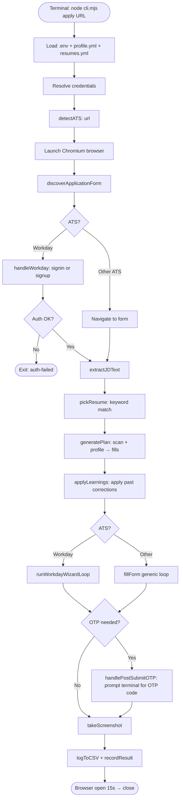

---

## 2. Sign-In Flow (Workday — Corrected)

> Triggered when `--signup` is not passed (default mode). Gateway appears after clicking Apply Manually.

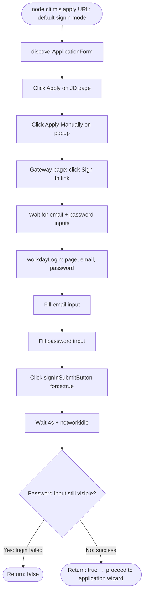

---

## 3. Sign-Up Flow (Workday — Corrected)

> Triggered when `--signup` flag is passed.

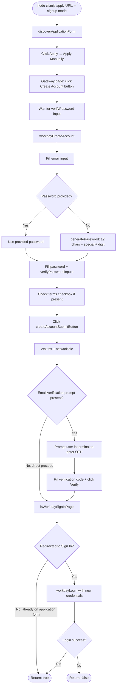

---

## 4. ATS Discovery Flow (All ATS — Existing)

> Based on `lib/discovery.mjs` `discoverApplicationForm()`

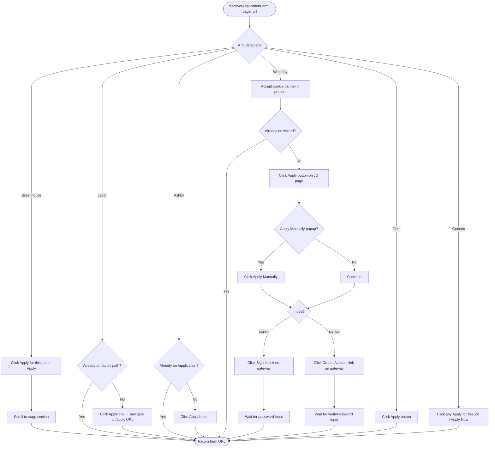

---

## 5. Form Scan Flow (Existing)

> Based on `lib/scanner.mjs` `scanForm()`

```mermaid
flowchart TD
    A([scanForm: url]) --> B[Navigate to URL]
    B --> C[discoverApplicationForm]
    C --> D{ATS = Workday?}
    D -->|Yes| E[handleWorkday: authenticate]
    D -->|No| F[Already on form]
    E --> F
    F --> G[DOM pass 1: querySelectorAll input + textarea + select]
    G --> H[Extract label via: for-id, aria-label, aria-labelledby, placeholder, sibling text, data-automation-id]
    H --> I[DOM pass 2: custom dropdowns with role=listbox or combobox]
    I --> J[DOM pass 3: yes-no-button questions]
    J --> K[Detect submit buttons]
    K --> L[Write {slug}-scan.json]
    L --> M([Return scan object])
```

---

## 6. Plan Generation Flow (Existing)

> Based on `lib/planner.mjs` `generatePlan()`

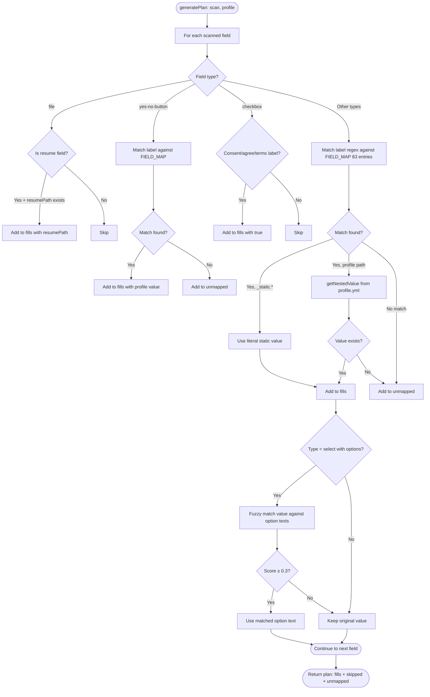

---

## 7. Workday Wizard Fill Loop (Existing)

> Based on `lib/engine.mjs` `runWorkdayWizardLoop()`

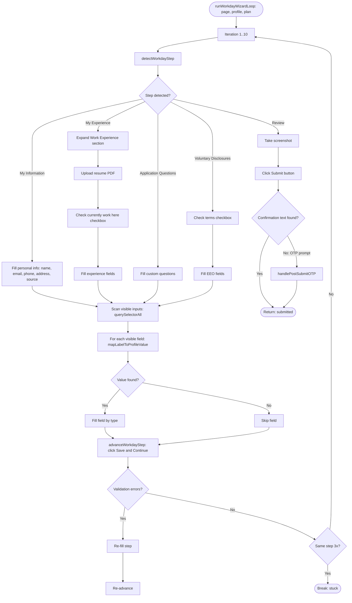

---

## 8. OTP Handling Flow (Corrected — Terminal Prompt in V0/V1)

> Based on `lib/otp.mjs` (pre-dashboard flow)

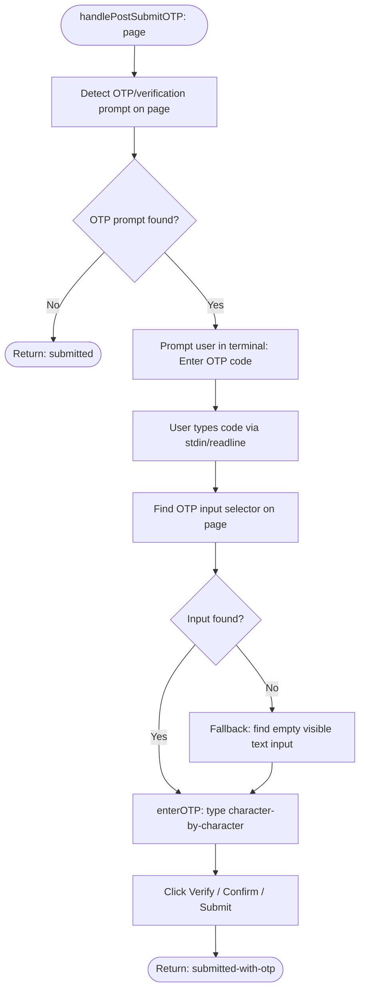

---

## 9. Telegram Confirmation Flow (V1 — Planned)

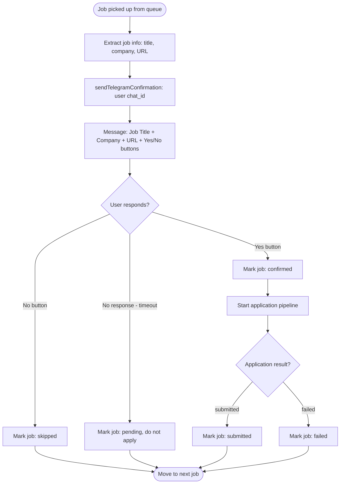

---

## 10. Telegram Q&A Fallback & Answer Persistence Flow (V1+ — Planned)

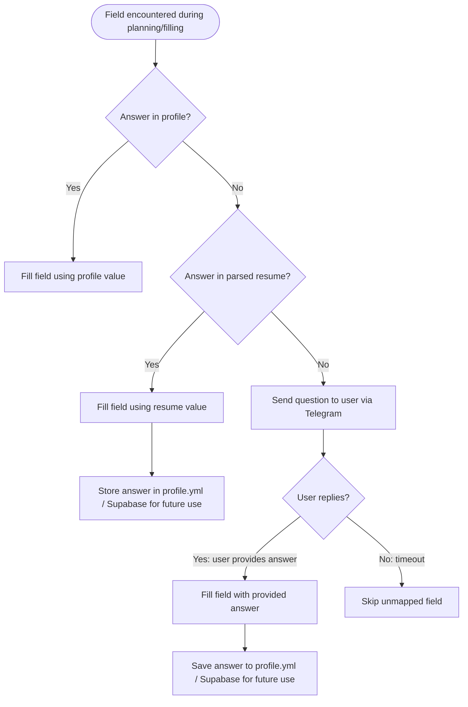

---

## 11. Multi-User Parallel Workers & Sequential Job Queue Flow (V2 — Planned)

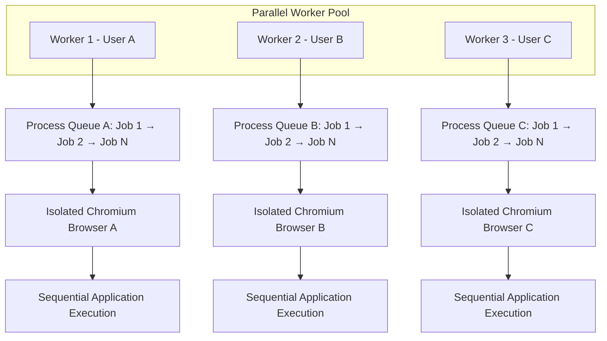

---

## 12. System-Level Data Flow (V2 — Planned)

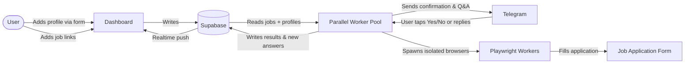
