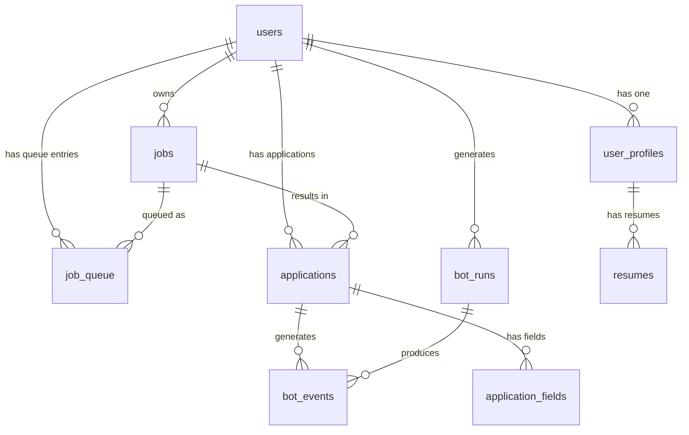

# Backend Schema — Supabase Database Design

## Overview

The Supabase backend replaces all local flat files (profile YAML, queue CSV, learnings JSON, applied CSV) with a structured PostgreSQL database. It supports multiple users, per-user job queues, application tracking, bot status, and Telegram workflow data.

All tables use Row Level Security (RLS). The dashboard uses the `anon` key scoped to the authenticated user's session. The bot worker uses the `service_role` key for unrestricted access.

---

## Entity Relationship Diagram



---

## Tables

### `users`

Managed by Supabase Auth. Extended with application-level fields.

```sql
-- Managed by Supabase Auth
-- auth.users table (built-in)

-- Application-level extension
CREATE TABLE users (
  id          UUID PRIMARY KEY REFERENCES auth.users(id),
  email       TEXT NOT NULL,
  full_name   TEXT,
  telegram_chat_id TEXT,       -- Telegram chat_id for confirmation messages
  created_at  TIMESTAMPTZ DEFAULT NOW(),
  updated_at  TIMESTAMPTZ DEFAULT NOW()
);
```

---

### `user_profiles`

Full profile data for each user. Directly maps to the existing `config/profile.yml` structure. This is the source of truth for all application answers.

```sql
CREATE TABLE user_profiles (
  id                    UUID PRIMARY KEY DEFAULT gen_random_uuid(),
  user_id               UUID NOT NULL REFERENCES users(id) ON DELETE CASCADE,

  -- Personal
  first_name            TEXT,
  last_name             TEXT,
  email                 TEXT,
  phone                 TEXT,
  phone_extension       TEXT,
  linkedin_url          TEXT,
  location              TEXT,
  city                  TEXT,
  state                 TEXT,
  postal_code           TEXT,
  address_line1         TEXT,
  address_line2         TEXT,
  country               TEXT DEFAULT 'United States',
  country_phone_code    TEXT DEFAULT 'United States +1',
  how_did_you_hear      TEXT DEFAULT 'LinkedIn',
  consent_agreement     BOOLEAN DEFAULT TRUE,

  -- Education
  degree                TEXT,
  major                 TEXT,
  university            TEXT,
  graduation_year       TEXT,
  gpa                   TEXT,

  -- Experience
  years_of_experience   TEXT,
  current_company       TEXT,
  current_title         TEXT,
  salary_expectation    TEXT,
  notice_period         TEXT,

  -- Work Authorization
  authorized_us         TEXT DEFAULT 'Yes',
  sponsorship_needed    TEXT DEFAULT 'No',
  visa_status           TEXT,
  office_willing        TEXT DEFAULT 'Yes',
  willing_to_relocate   TEXT DEFAULT 'Yes',
  remote_preference     TEXT,

  -- EEO / Voluntary Disclosures
  gender                TEXT,
  hispanic_latino       TEXT DEFAULT 'No',
  race                  TEXT,
  veteran_status        TEXT DEFAULT 'I am not a protected veteran',
  disability_status     TEXT DEFAULT 'I do not want to answer',

  -- Credentials (encrypted at application level before storing)
  workday_email         TEXT,
  workday_password_enc  TEXT,      -- encrypted, service_role only
  otp_email             TEXT,
  otp_app_password_enc  TEXT,      -- encrypted, service_role only

  -- Saved Answers (from resume parsing & Telegram Q&A fallback)
  custom_answers        JSONB DEFAULT '{}'::jsonb,

  created_at            TIMESTAMPTZ DEFAULT NOW(),
  updated_at            TIMESTAMPTZ DEFAULT NOW(),

  UNIQUE (user_id)
);
```

---

### `resumes`

Resume PDF files per user, stored in Supabase Storage.

```sql
CREATE TABLE resumes (
  id            UUID PRIMARY KEY DEFAULT gen_random_uuid(),
  user_id       UUID NOT NULL REFERENCES users(id) ON DELETE CASCADE,
  label         TEXT NOT NULL,               -- "Software Engineer Resume"
  storage_path  TEXT NOT NULL,               -- Supabase Storage path
  keywords      TEXT[],                      -- for resume selection matching
  is_default    BOOLEAN DEFAULT FALSE,
  uploaded_at   TIMESTAMPTZ DEFAULT NOW()
);
```

---

### `jobs`

All job links submitted by users.

```sql
CREATE TABLE jobs (
  id            UUID PRIMARY KEY DEFAULT gen_random_uuid(),
  user_id       UUID NOT NULL REFERENCES users(id) ON DELETE CASCADE,
  url           TEXT NOT NULL,
  company       TEXT,
  role          TEXT,
  ats           TEXT,                        -- greenhouse, lever, ashby, workday, gem, generic
  location      TEXT,
  notes         TEXT,
  added_at      TIMESTAMPTZ DEFAULT NOW(),

  UNIQUE (user_id, url)
);
```

---

### `job_queue`

Per-user queue entries. One row per (user, job). Status drives the bot's processing order.

```sql
CREATE TABLE job_queue (
  id              UUID PRIMARY KEY DEFAULT gen_random_uuid(),
  user_id         UUID NOT NULL REFERENCES users(id) ON DELETE CASCADE,
  job_id          UUID NOT NULL REFERENCES jobs(id) ON DELETE CASCADE,

  status          TEXT NOT NULL DEFAULT 'pending'
                  CHECK (status IN (
                    'pending',           -- added, not yet sent to Telegram
                    'awaiting_confirm',  -- Telegram message sent, waiting for user
                    'confirmed',         -- user said Yes → ready to apply
                    'skipped',           -- user said No
                    'processing',        -- bot claimed this job
                    'submitted',         -- application submitted
                    'failed',            -- application failed
                    'error'              -- unexpected error
                  )),

  telegram_message_id TEXT,              -- Telegram message ID for editing/tracking
  confirmed_at    TIMESTAMPTZ,
  processing_at   TIMESTAMPTZ,
  completed_at    TIMESTAMPTZ,
  added_at        TIMESTAMPTZ DEFAULT NOW(),
  updated_at      TIMESTAMPTZ DEFAULT NOW(),

  UNIQUE (user_id, job_id)
);

-- Index for efficient queue polling
CREATE INDEX idx_job_queue_pending ON job_queue (user_id, status, added_at)
  WHERE status IN ('pending', 'confirmed');
```

---

### `applications`

Detailed record of each application attempt.

```sql
CREATE TABLE applications (
  id              UUID PRIMARY KEY DEFAULT gen_random_uuid(),
  user_id         UUID NOT NULL REFERENCES users(id) ON DELETE CASCADE,
  job_id          UUID NOT NULL REFERENCES jobs(id) ON DELETE CASCADE,
  queue_id        UUID REFERENCES job_queue(id),

  status          TEXT NOT NULL DEFAULT 'started'
                  CHECK (status IN (
                    'started',
                    'scanning',
                    'planning',
                    'filling',
                    'submitted',
                    'submitted_with_otp',
                    'needs_otp',
                    'auth_failed',
                    'failed',
                    'error'
                  )),

  ats             TEXT,
  resume_id       UUID REFERENCES resumes(id),
  fills_count     INT DEFAULT 0,
  unmapped_count  INT DEFAULT 0,
  error_message   TEXT,
  screenshot_url  TEXT,                  -- Supabase Storage URL of post-submit screenshot

  started_at      TIMESTAMPTZ DEFAULT NOW(),
  completed_at    TIMESTAMPTZ,
  updated_at      TIMESTAMPTZ DEFAULT NOW()
);
```

---

### `application_fields`

Per-field fill results for debugging and learnings.

```sql
CREATE TABLE application_fields (
  id              UUID PRIMARY KEY DEFAULT gen_random_uuid(),
  application_id  UUID NOT NULL REFERENCES applications(id) ON DELETE CASCADE,
  field_label     TEXT,
  field_type      TEXT,
  field_id        TEXT,
  value_used      TEXT,
  status          TEXT CHECK (status IN ('filled', 'skipped', 'unmapped', 'error')),
  error_message   TEXT,
  created_at      TIMESTAMPTZ DEFAULT NOW()
);
```

---

### `bot_events`

Live event stream for the monitoring dashboard.

```sql
CREATE TABLE bot_events (
  id              UUID PRIMARY KEY DEFAULT gen_random_uuid(),
  user_id         UUID REFERENCES users(id),
  application_id  UUID REFERENCES applications(id),
  job_id          UUID REFERENCES jobs(id),

  event_type      TEXT NOT NULL
                  CHECK (event_type IN (
                    'bot_started',
                    'bot_idle',
                    'bot_error',
                    'job_picked',
                    'telegram_sent',
                    'telegram_confirmed',
                    'telegram_skipped',
                    'scan_started',
                    'scan_complete',
                    'plan_generated',
                    'fill_started',
                    'step_filled',         -- Workday wizard step
                    'step_advanced',
                    'field_filled',
                    'field_skipped',
                    'field_unmapped',
                    'field_error',
                    'resume_uploaded',
                    'otp_sent',
                    'otp_entered',
                    'submitted',
                    'failed'
                  )),

  message         TEXT,
  metadata        JSONB,                   -- step name, field label, value, etc.
  created_at      TIMESTAMPTZ DEFAULT NOW()
);

-- Index for dashboard realtime feed per user
CREATE INDEX idx_bot_events_user ON bot_events (user_id, created_at DESC);
```

---

### `bot_runs`

Overall bot worker session tracking.

```sql
CREATE TABLE bot_runs (
  id              UUID PRIMARY KEY DEFAULT gen_random_uuid(),
  user_id         UUID REFERENCES users(id),
  status          TEXT CHECK (status IN ('running', 'idle', 'error', 'stopped')),
  current_job_id  UUID REFERENCES jobs(id),
  current_step    TEXT,
  started_at      TIMESTAMPTZ DEFAULT NOW(),
  heartbeat_at    TIMESTAMPTZ DEFAULT NOW(),
  stopped_at      TIMESTAMPTZ
);
```

---

### `learnings`

Migrated from local `data/learnings.json`. Stores self-learning corrections per ATS.

```sql
CREATE TABLE learnings (
  id              UUID PRIMARY KEY DEFAULT gen_random_uuid(),
  ats             TEXT NOT NULL,
  learning_type   TEXT CHECK (learning_type IN (
                    'field_correction',
                    'option_mapping',
                    'ats_quirk'
                  )),
  field_label     TEXT,
  field_id        TEXT,
  plan_value      TEXT,
  actual_value    TEXT,
  fail_count      INT DEFAULT 1,
  notes           TEXT,
  last_seen       TIMESTAMPTZ DEFAULT NOW(),
  created_at      TIMESTAMPTZ DEFAULT NOW()
);
```

---

## Row Level Security (RLS) Policies

```sql
-- users: user can read/update their own row
ALTER TABLE users ENABLE ROW LEVEL SECURITY;
CREATE POLICY "users: own row" ON users
  USING (id = auth.uid());

-- user_profiles: user can read/update their own profile
ALTER TABLE user_profiles ENABLE ROW LEVEL SECURITY;
CREATE POLICY "profiles: own" ON user_profiles
  USING (user_id = auth.uid());

-- Block encrypted credentials from client reads
CREATE POLICY "profiles: no encrypted creds" ON user_profiles
  AS RESTRICTIVE
  USING (auth.role() = 'service_role' OR (
    workday_password_enc IS NULL AND otp_app_password_enc IS NULL
  ));

-- jobs: user can CRUD their own jobs
ALTER TABLE jobs ENABLE ROW LEVEL SECURITY;
CREATE POLICY "jobs: own" ON jobs
  USING (user_id = auth.uid());

-- job_queue: user can read their own queue; bot (service_role) can update any
ALTER TABLE job_queue ENABLE ROW LEVEL SECURITY;
CREATE POLICY "queue: own read" ON job_queue
  USING (user_id = auth.uid());

-- applications: user can read their own; service_role can write
ALTER TABLE applications ENABLE ROW LEVEL SECURITY;
CREATE POLICY "applications: own read" ON applications
  USING (user_id = auth.uid());

-- bot_events: user can read their own events (for dashboard)
ALTER TABLE bot_events ENABLE ROW LEVEL SECURITY;
CREATE POLICY "events: own read" ON bot_events
  USING (user_id = auth.uid());
```

---

## Key Database Functions / RPCs

### Atomic Job Claim

Prevents two bot workers from claiming the same job simultaneously.

```sql
CREATE OR REPLACE FUNCTION claim_next_job(p_user_id UUID)
RETURNS SETOF job_queue
LANGUAGE sql
AS $$
  UPDATE job_queue
  SET
    status = 'processing',
    processing_at = NOW(),
    updated_at = NOW()
  WHERE id = (
    SELECT id FROM job_queue
    WHERE user_id = p_user_id
      AND status = 'confirmed'
    ORDER BY added_at ASC
    LIMIT 1
    FOR UPDATE SKIP LOCKED
  )
  RETURNING *;
$$;
```

---

## Supabase Storage Buckets

| Bucket | Purpose | Access |
|---|---|---|
| `resumes` | User resume PDF files | Private; signed URLs for bot reads |
| `screenshots` | Post-submit application screenshots | Private; signed URLs for dashboard display |

---

## Data Migration from V0

| V0 Source | V2 Destination |
|---|---|
| `config/profile.yml` | `user_profiles` table |
| `config/resumes.yml` + PDF files | `resumes` table + `resumes` storage bucket |
| `data/queue.csv` | `job_queue` table |
| `data/applied.csv` | `applications` table |
| `data/learnings.json` | `learnings` table |
| `.env` credentials | `user_profiles.workday_password_enc` + `otp_app_password_enc` (encrypted) |
| Screenshots folder | `screenshots` storage bucket |
