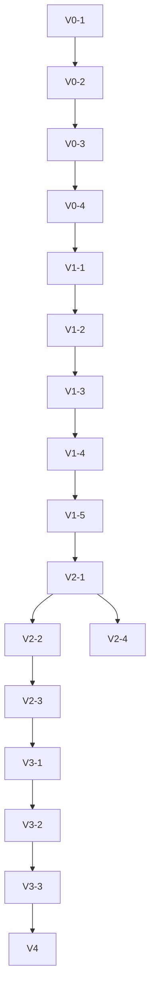

# Implementation Plan — Job Application Automation Bot

## Overview

Development progresses through five versions (V0–V4). Each version has clearly scoped phases. V0 stabilizes the existing automation. V1 adds Telegram and multi-job support. V2 adds Supabase, multi-user, and the monitoring dashboard. V3 handles deployment infrastructure. V4 expands into a full product.

---

## V0 — Core Existing Automation

**Goal:** Make the existing automation work reliably without adding new features. The V0 flow is entirely terminal-driven.

```
Terminal Command + Job URL
        ↓
Bot Starts
        ↓
Sign In or Sign Up (--signin / --signup flag)
        ↓
Navigate to Job
        ↓
Scan Application Form
        ↓
Identify Questions
        ↓
Plan Answers from profile.yml
        ↓
Fill Application Fields
        ↓
Repeat Until Complete (Workday wizard loop)
        ↓
Submit Application
```

### Phase V0-1 — Audit and Stabilize Core Engine

**Goal:** Identify and fix reliability issues in the existing automation pipeline.

**Tasks:**
- Run end-to-end test against a real Workday job URL
- Run end-to-end test against a real Greenhouse job URL
- Document all failure modes encountered (unmapped fields, stuck wizard, OTP timeout)
- Fix any crashes or unhandled edge cases in `engine.mjs` fill loop
- Ensure `detectWorkdayStep()` correctly handles all 5 wizard steps
- Verify resume upload waits for completion before advancing
- Test `--signin` mode with valid Workday credentials
- Test `--signup` mode with new email + OTP verification

**Files touched:** `lib/engine.mjs`, `lib/workday.mjs`, `lib/scanner.mjs`

**Checkpoint:** Bot completes a Workday application end-to-end from scan → fill → submit without crash.

---

### Phase V0-2 — Harden OTP and Auth Flows

**Goal:** Workday auth is reliable and OTP prompt via terminal works seamlessly without Gmail IMAP.

**Tasks:**
- Implement terminal prompt (`readline`) for OTP code entry when verification prompt is detected on page
- Test character-by-character OTP typing (`.type()` with delay)
- Remove Gmail IMAP polling requirement for V0/V1
- Fix sign-in flow: navigate directly to gateway upon Apply Manually and click Sign In without redundant pre-checks
- Fix sign-up flow: only trigger OTP verification if verification prompt appears after account creation submit
- Add clear error messages when credentials are missing or wrong
- Ensure sign-in failure returns clean error, not crash
- Ensure sign-up correctly handles "email already registered" case
- Add timeout protection to `workdayCreateAccount()`

**Files touched:** `lib/otp.mjs`, `lib/workday.mjs`, `cli.mjs`

**Checkpoint:** OTP is requested via terminal prompt and entered correctly. Auth failures are reported cleanly, not as crashes.

---

### Phase V0-3 — Improve Field Mapping Coverage

**Goal:** Reduce unmapped fields for common ATS forms and support standard name aliases.

**Tasks:**
- Add aliases to `FIELD_MAP`: map "given name" to `personal.first_name` and "family name" / "surname" to `personal.last_name`
- Run scanner on 5+ different job URLs (Workday, Greenhouse, Lever, Ashby)
- Review unmapped field logs from each
- Add missing patterns to `FIELD_MAP` in `planner.mjs`
- Test fuzzy matching improvements for dropdown options
- Verify EEO fields fill correctly on Workday Voluntary Disclosures step
- Add any missing field types to the fill engine

**Files touched:** `lib/planner.mjs`, `lib/engine.mjs`, `lib/fields.mjs`

**Checkpoint:** <3 unmapped fields on a standard Workday application. "Given name" and "Family name" map accurately. EEO fields fill without manual intervention.

---

### Phase V0-4 — Queue and Batch Reliability

**Goal:** Batch processing works reliably for multiple URLs.

**Tasks:**
- Test `queue add` → `batch` flow end-to-end
- Fix any queue status update failures
- Ensure failed jobs in batch do not stop remaining jobs
- Add per-job error isolation in `cmdBatch()`
- Verify `data/applied.csv` is written correctly for all statuses
- Verify `data/learnings.json` accumulates correctly across runs

**Files touched:** `cli.mjs`, `lib/reporter.mjs`, `lib/learner.mjs`

**Checkpoint:** A batch of 3 URLs runs; one intentional failure does not prevent the other two from completing. All results logged to CSV.

---

## V1 — Telegram Approval + Multi-Job Flow

**Goal:** Add Telegram confirmation before each application. Support up to 20 jobs sequentially for one user. Add resume parsing for better answer coverage.

```
Job Link in Queue
        ↓
Bot Picks Job
        ↓
Send Telegram Message (Job Title + Company + URL + Yes/No buttons)
        ↓
User Responds
      ↙     ↘
   YES       NO
    ↓         ↓
 Apply      Skip → Next Job
    ↓
Full Application Pipeline
        ↓
Next Job
```

### Phase V1-1 — Telegram Bot Setup

**Goal:** Telegram bot exists, can send messages, and receives button callbacks.

**Tasks:**
- Create Telegram bot via BotFather; store token in `.env`
- Add `TELEGRAM_BOT_TOKEN` and `TELEGRAM_CHAT_ID` to `.env`
- Install `node-telegram-bot-api` or use native `fetch` to Telegram API
- Build `telegram/bot.mjs` — send message with inline keyboard
- Build `telegram/webhook.mjs` — handle callback_query (Yes/No button press)
- Set up webhook endpoint (local `ngrok` or polling mode for V1)
- Test: send message → user taps Yes → bot receives callback

**New files:** `telegram/bot.mjs`, `telegram/webhook.mjs`

**Checkpoint:** Bot sends a test message with Yes/No buttons. Tapping Yes logs "confirmed" to console. Tapping No logs "skipped".

---

### Phase V1-2 — Job Info Extraction

**Goal:** Before sending Telegram confirmation, extract meaningful job info from the URL/page.

**Tasks:**
- Build `telegram/extractJobInfo.mjs` — navigate to job URL, extract title, company, location from page DOM
- Support Workday, Greenhouse, Lever, Ashby job description pages
- Fall back to URL hostname + path if DOM extraction fails
- Format extracted info into Telegram message template

**New files:** `telegram/extractJobInfo.mjs`

**Checkpoint:** Given a real Workday job URL, bot extracts title + company and formats them into the Telegram message correctly.

---

### Phase V1-3 — Telegram-Gated Application Loop

**Goal:** Bot processes jobs sequentially; each job requires Telegram confirmation before applying.

**Tasks:**
- Build `queue/processQueue.mjs` — load pending jobs, loop through up to 20
- For each job: call `extractJobInfo` → send Telegram confirmation → wait for response (timeout: 5 min)
- On Yes: run full application pipeline (`cmdApply`)
- On No / timeout: mark as skipped, move to next job
- Update queue status at each step
- Add `TELEGRAM_CONFIRMATION_TIMEOUT_MS` to `.env`

**New files:** `queue/processQueue.mjs`
**Modified files:** `cli.mjs` (new `process-queue` command)

**Checkpoint:** Queue of 3 jobs runs. First job: user taps Yes → application runs. Second job: user taps No → skipped. Third job: no response in timeout → skipped. All statuses correct in queue CSV.

---

### Phase V1-4 — Resume Parsing & Answer Persistence

**Goal:** When profile.yml doesn't have an answer for a field, extract it from resume content and persist it to profile.yml for future runs.

**Tasks:**
- Install `pdf-parse` or similar PDF text extraction library
- Build `lib/resumeParser.mjs` — extract text and structured key-value answers from resume PDF
- In `generatePlan()`: after FIELD_MAP miss, search resume text for relevant keywords/answers
- Persist discovered answers back into `profile.yml` so they become permanently available for all subsequent applications
- Log which answers were derived from resume vs profile

**New files:** `lib/resumeParser.mjs`
**Modified files:** `lib/planner.mjs`, `config/profile.yml`

**Checkpoint:** Given a resume mentioning "3 years of experience in Python", the "Years of Experience" field is filled with "3", and the value is saved to `profile.yml` for future runs.

---

### Phase V1-5 — Telegram Q&A Fallback for Unmapped Questions

**Goal:** If a question cannot be answered from profile or resume, prompt user on Telegram, use the answer, and store it.

**Tasks:**
- Build `telegram/fallbackQA.mjs` — send question text to user chat_id when answer is missing
- Wait for user response (with configurable timeout)
- When user replies, fill the form field with the provided answer
- Immediately write the question-answer pair into `profile.yml` (acting as local DB before Supabase) for future reuse
- If timeout expires with no reply, mark field as unmapped and proceed

**New files:** `telegram/fallbackQA.mjs`
**Modified files:** `lib/engine.mjs`, `lib/planner.mjs`, `telegram/bot.mjs`

**Checkpoint:** On encountering an unknown custom question, bot messages user on Telegram. User replies "No"; bot fills "No", saves it to `profile.yml`, and completes application.

---

## V2 — Supabase + Multi-User + Monitoring Dashboard

**Goal:** All data moves to Supabase. Bot reads profiles and jobs from database. Support ~10 users. Build monitoring dashboard.

```
User Added via Dashboard
        ↓
Profile Saved to Supabase
        ↓
Job Links Added via Dashboard
        ↓
Jobs Stored in Supabase
        ↓
Per-User Job Queue Created
        ↓
Parallel Worker Pool Starts (1 Worker per User)
        ↓
Telegram Confirmation & Q&A Fallback
        ↓
Sequential Applications per User in Isolated Browsers
        ↓
Dashboard Shows Live Status
```

### Phase V2-1 — Supabase Schema and Migrations

**Goal:** All tables, indexes, RLS policies, and RPCs exist in Supabase.

**Tasks:**
- Create Supabase project
- Run migrations for all tables per `05-backend-schema.md`:
  `users`, `user_profiles`, `resumes`, `jobs`, `job_queue`,
  `applications`, `application_fields`, `bot_events`, `bot_runs`, `learnings`
- Apply all RLS policies
- Create `claim_next_job` RPC
- Create `resumes` and `screenshots` storage buckets
- Test: two simultaneous `claim_next_job` calls return exactly one row

**New files:** `supabase/migrations/`

**Checkpoint:** All tables queryable. RLS blocks cross-user reads. Atomic claim returns one row under concurrency.

---

### Phase V2-2 — Bot Data Layer (Supabase Integration)

**Goal:** Bot reads profile, credentials, and jobs from Supabase instead of local files.

**Tasks:**
- Build `lib/supabaseClient.mjs` — Supabase client with service role key
- Build `lib/dataLayer.mjs` — typed functions:
  - `getProfile(userId)` → returns full `user_profiles` row
  - `getResumePath(userId)` → download resume from storage, return local temp path
  - `claimNextJob(userId)` → call `claim_next_job` RPC
  - `updateJobStatus(queueId, status)` → update `job_queue`
  - `createApplication(userId, jobId)` → insert `applications` row
  - `updateApplication(appId, data)` → update status/fields
  - `saveAnswer(userId, fieldLabel, answer)` → store newly answered questions from resume/Telegram
  - `logEvent(event)` → insert `bot_events` row
  - `recordLearning(learning)` → insert `learnings` row
- Migrate `loadProfile()` and `pickResume()` to use Supabase data layer
- Migrate `recordResult()` and queue management to use Supabase

**New files:** `lib/supabaseClient.mjs`, `lib/dataLayer.mjs`
**Modified files:** `lib/planner.mjs`, `lib/reporter.mjs`, `lib/learner.mjs`

**Checkpoint:** Bot can load profile from Supabase, claim a job, run the application pipeline, and write results back — with zero local files.

---

### Phase V2-3 — Parallel Multi-User Worker Pool

**Goal:** Concurrent worker pool where each user gets an independent worker executing their queue sequentially in an isolated browser.

**Tasks:**
- Build `queue/workerPool.mjs` — orchestrates parallel user workers
- For N active users with pending/confirmed jobs, launch N parallel workers (e.g., 3 users = 3 concurrent workers)
- Each worker opens an isolated Chromium browser instance for each job in that user's queue
- Within each user worker, jobs are processed strictly sequentially (one after another)
- Worker loop repeats per user until all jobs in that user's queue are exhausted
- Each worker tracks its own heartbeat in `bot_runs` and logs events to `bot_events`
- Handle graceful worker isolation and teardown on error or completion

**New files:** `queue/workerPool.mjs`, `bot/worker.mjs`
**Modified files:** `bot/index.mjs`

**Checkpoint:** Given 3 users with 2 jobs each, 3 workers run concurrently in parallel, each opening its own isolated browser, applying sequentially to its user's queue until all 6 jobs are finished.

---

### Phase V2-4 — Monitoring Dashboard

**Goal:** React dashboard showing live bot status, job queue, user management, and events.

**Tasks:**
- Scaffold React app (Vite or Next.js)
- Build `Dashboard` screen — BotStatusCard, JobQueueTable, EventLog
- Wire `bot_events` Supabase Realtime subscription → EventLog
- Wire `job_queue` Supabase Realtime subscription → JobQueueTable
- Wire `bot_runs` Supabase Realtime → BotStatusCard
- Build `Users` screen — UserTable
- Build `Add User` / `Edit User` form — UserProfileForm (all fields per `04-ui-ux.md`)
- Build `Add Job` modal
- Build `Job Detail` screen — application steps + unmapped fields + screenshot
- Add Supabase Auth login for dashboard access

**New directory:** `dashboard/`

**Checkpoint:** Opening dashboard shows live bot status. Adding a job via form creates a `jobs` row. Application events stream into EventLog without page refresh.

---

## V3 — Deployment Infrastructure

**Goal:** Bot runs reliably in a cloud environment. No local machine required.

### Phase V3-1 — Headless Browser Support

**Goal:** Bot works with `headless: true` in Chromium.

**Tasks:**
- Change `chromium.launch({ headless: true })` in `engine.mjs` and `scanner.mjs`
- Test all Workday wizard steps in headless mode
- Fix any DOM detection issues that only appear in headless mode
- Add `--no-sandbox` and `--disable-dev-shm-usage` Chromium flags for container environment
- Add `xvfb` fallback if headless mode has issues with specific ATS

**Modified files:** `lib/engine.mjs`, `lib/scanner.mjs`, `lib/workday.mjs`

**Checkpoint:** Full Workday application completes headlessly. No display required.

---

### Phase V3-2 — Docker Containerization

**Goal:** Bot runs inside a Docker container with all dependencies.

**Tasks:**
- Write `Dockerfile` using `mcr.microsoft.com/playwright/chromium` as base
- Install Node.js + npm dependencies inside container
- Install Playwright + Chromium browser binary
- Copy bot source files into container
- Expose environment variable configuration
- Write `docker-compose.yml` for local testing
- Test: `docker run` starts bot worker, connects to Supabase, processes a job

**New files:** `Dockerfile`, `docker-compose.yml`, `.dockerignore`

**Checkpoint:** `docker build` succeeds. `docker run` with correct env vars starts the bot worker and processes a job end-to-end.

---

### Phase V3-3 — Railway Deployment

**Goal:** Bot worker runs continuously on Railway.

**Tasks:**
- Create Railway project; connect to GitHub repo
- Configure Railway environment variables (all secrets from `.env`)
- Set Railway start command to `node bot/index.mjs`
- Configure Railway health check via heartbeat endpoint or `bot_runs` table
- Test deployment: bot starts on Railway, connects to Supabase, heartbeat visible
- Configure Railway auto-restart on failure

**Checkpoint:** Bot runs on Railway without local machine. Applies to a real job URL from the Supabase queue. `bot_runs` heartbeat updates every 30s. Dashboard shows live status from Railway-hosted bot.

---

## V4 — Full Product Website

**Goal:** Expand the project into a consumer-facing product. Scope and exact features to be defined based on everything learned in V0–V3.

### Direction Areas (To Be Scoped After V3)

- Public landing page and product website
- User onboarding flow (guided setup: profile → Telegram link → first job)
- Billing and plan management (free tier / paid tiers)
- Expanded ATS coverage based on user demand
- Application analytics (success rates, time saved, ATS breakdown)
- Resume tailoring per job (LLM-assisted)
- Multi-resume management UI
- Email notifications as alternative to Telegram
- Admin panel for managing all users

---

## Phase Dependency Map



---

## Checkpoint Summary

| Phase | Checkpoint Condition |
|---|---|
| V0-1 | Workday application completes end-to-end without crash |
| V0-2 | Terminal OTP prompt works; direct sign-in & conditional sign-up OTP verified |
| V0-3 | <3 unmapped fields on standard Workday form; given name & family name aliases work |
| V0-4 | Batch of 3 jobs: one fail does not stop others; all statuses logged |
| V1-1 | Telegram Yes/No buttons work; callbacks received |
| V1-2 | Job info extracted from real Workday URL |
| V1-3 | 3-job queue: Yes applies, No skips, timeout skips |
| V1-4 | Resume parsed answers fill missing fields and are saved to profile.yml for future runs |
| V1-5 | Telegram Q&A fallback retrieves answer for unknown question and saves to profile.yml |
| V2-1 | RLS blocks cross-user reads; atomic claim returns one row |
| V2-2 | Bot reads profile from Supabase; writes results back; no local files |
| V2-3 | 3 users' queues processed concurrently in parallel with isolated browsers |
| V2-4 | Dashboard events stream live; Add User form creates DB row |
| V3-1 | Full Workday application completes headlessly |
| V3-2 | `docker run` starts bot and processes a job |
| V3-3 | Bot on Railway processes job; dashboard shows live Railway status |

---

## Development Notes

- **Never use `headless: false` in production** — only for local debugging
- **Never commit secrets** — all credentials via environment variables
- **Always test auth flows** with both `--signin` and `--signup` modes before declaring a phase done
- **Screenshot every Workday step** — critical for debugging wizard failures
- **Keep the existing `cli.mjs` working throughout V1** — it is the fallback and development tool
- **Supabase service role key** is never exposed to the dashboard client — dashboard uses anon key with RLS
